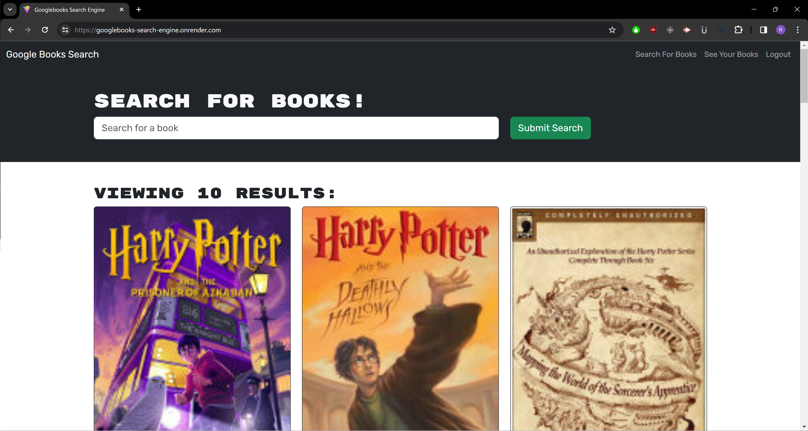
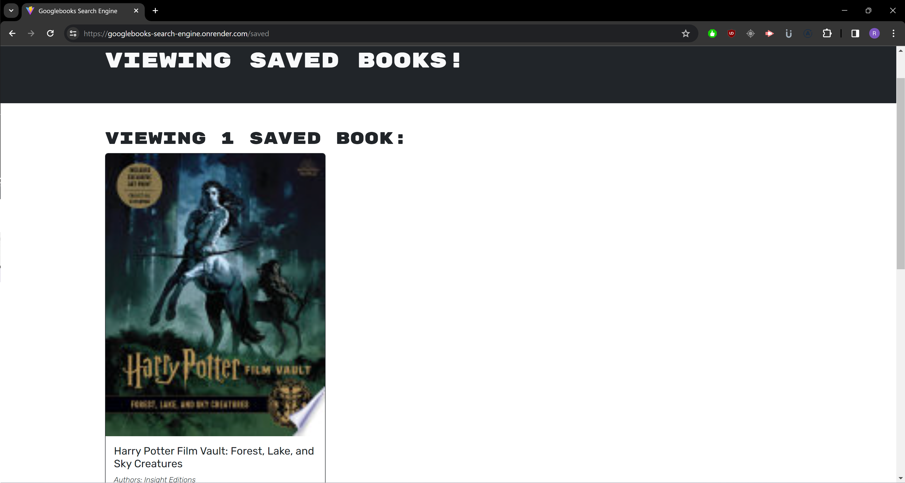

# Googlebooks Search Engine - Module 21 Challenge

## Table of Contents

1. [Description](#description)
2. [Installation](#installation)
3. [Usage](#usage)
4. [Contributors](#contributors)
5. [License](#license)
6. [Link](#link)
7. [Screenshots](#screenshots)

## Description

This project was designed to be a resource to search the Google books API and save books to a database for later recollection. It can be useful to catalog books you enjoy, want to read, or may be required to read for school. The app has access to the entire catalogue and stores data via MongoDB locally or via MongoDB Atlas when used online via render. Thinking in the future, it is a useful way to integrate APIs and save data on my own webpage from virtually any database API and that's incredibly useful. In my case, I have a couple of upcoming projects that can certainly use this kind of feature. This project was a tricky one because it required conversion from rest API to GraphQL and the use of resolvers and mutations to manipulate data. I learned a lot about back-end processes and general debugging. This module in particular highlighted the importance of error handling in functions and logging everything. I also learned how to navigate the Dev Tools much more fluently and watching responses through the Network to troubleshoot while reviewing what is making connections and where the code breaks, which I believe is an invaluable and necessary part of coding in general. Finally, it gave me a deeper understanding of how the front-end and the back-end can communicate and store data through React.

## Installation

N/A

## Usage

Using this app is easy. Just type in the name of the book you want to look up in the search bar and if the book exists in their catalog, it will render on the page. To utilize the app however, you need to create an account with a username, e-mail, and password. Once logged in, you have the ability to save searched books to the database which you can recall via the "See Your Books" link at the top of the page. To delete a book from your list, just click the delete button and it will be automatically removed from  your list and the database.

## Contributors

Source code was provided by coding-boot-camp at https://github.com/coding-boot-camp/solid-broccoli AskBCS also provided invaluable support for this project.

## License

This project has no license.

## Link

[Render](https://googlebooks-search-engine.onrender.com)

## Screenshots

